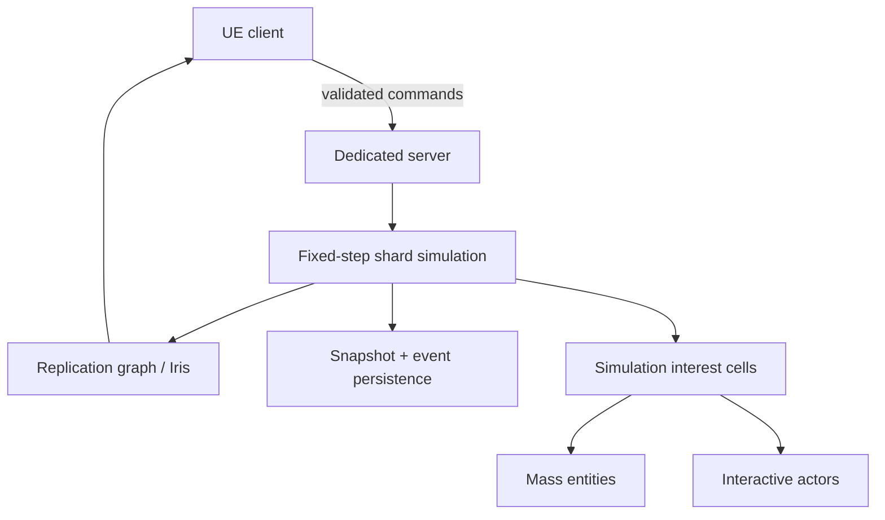

# Aetherfront architecture

## Product shape

Aetherfront is a persistent-world RTS, not a standard 1v1 session. Players join a generated frontier shard, claim territory, construct durable infrastructure, issue low-latency tactical commands, and leave a base that continues to exist while they are offline.

The first playable faction is the **Aster Assembly**, a modular expedition network that builds infrastructure from autonomous fabrication cells. It is an original silhouette, economy, production, and traversal system; it is not a renamed StarCraft faction.

## Non-negotiable boundaries

- The dedicated server is authoritative for commands, resources, construction, combat, visibility, and persistence.
- Rendering and selection presentation never own simulation truth.
- Durable state uses stable IDs and serializable records rather than raw Actor references.
- Nearby high-value units can be Actors; distant armies and ambient populations move to Mass Entity representations.
- World Partition streams presentation. Server simulation interest cells are an independent grid so persistence does not depend on loaded client cells.
- PCG generates deterministic biome and resource presentation from shard seed plus cell coordinate.
- Blender sources are original and export through a documented FBX pipeline with consistent units, pivots, sockets, collision, LODs, and animation names.

## Runtime topology

## Modules by checkpoint

### Checkpoint 1 — foundation

- game/editor/server targets
- authoritative game mode
- RTS camera and command-aware controller
- generated Engine-native visual world

### Checkpoint 2 — playable command loop

- click and marquee selection
- shift-add and control groups
- server-authoritative formation movement
- original worker, scout, citadel, relay, and resource blockouts
- construction preview, placement validation, costs, and build progress
- replicated resources and command acknowledgements

### Checkpoint 3 — persistence and generated shard

- stable player ID supplied during login
- world record schema and migration version
- append-only command/event journal plus periodic snapshots
- deterministic resource and biome cells
- World Partition bootstrap map and PCG graph
- rejoin and dedicated-server restart tests

### Checkpoint 4 — scale

- Replication Graph or Iris filters by simulation interest cell
- Actor/Mass representation switching with stable entity IDs
- hierarchical pathfinding: shard corridors, flow fields, local avoidance
- fog-of-war filtering on the server
- amortized construction, economy, and combat processors

## Persistence model

Local development writes versioned snapshots under `Saved/Aetherfront`. Production uses a world service backed by PostgreSQL-compatible durable storage and an append-only event stream. A record contains:

- shard and cell IDs
- entity UUID and content archetype ID
- owner and alliance IDs
- transform and navigation layer
- health, construction, orders, production queue, and inventory
- schema version and last authoritative simulation tick

The server loads only cells needed for simulation while preserving cold cells as records. Offline bases therefore do not require thousands of always-ticking Actors.

## Networking model

Clients send semantic commands: unit IDs, ability ID, target position/entity, queue modifier, and client command sequence. The server checks ownership, visibility, target validity, pathability, cost, tech requirements, cooldown, and rate limits. It then emits an acknowledgement or structured rejection and replicates resulting state.

This deliberately mirrors the useful *shape* of robust RTS protocols without copying proprietary implementation or data.

## Performance budgets

Initial desktop target at 1440p:

- 60 fps client frame target; 16.6 ms total
- 20 Hz authoritative strategy simulation, decoupled from rendering
- 30 Hz network driver with state relevancy filtering
- fewer than 2,000 high-fidelity Actors in a client interest region
- Mass/instanced representation for distant or low-interaction entities
- Nanite for suitable static environment art; skeletal LOD and animation budgeting for units
- Niagara significance and scalability tiers for combat VFX

The budgets will be measured in Unreal Insights; visual effects do not get an exemption from frame or replication budgets.

