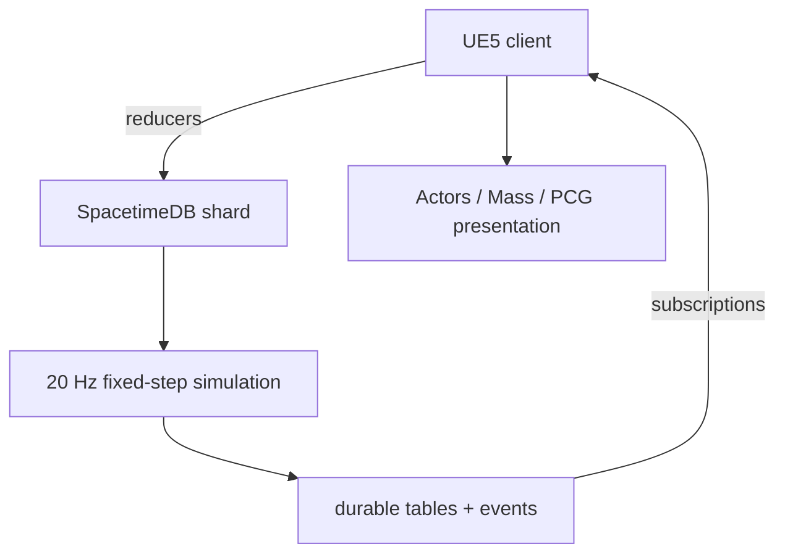

# Aetherfront architecture

## Product shape

Aetherfront is a persistent-world RTS, not a standard 1v1 session. Players join a generated frontier shard, claim territory, construct durable infrastructure, issue low-latency tactical commands, and leave a base that continues to exist while they are offline.

The first playable faction is the **Aster Assembly**, a modular expedition network that builds infrastructure from autonomous fabrication cells. It is an original silhouette, economy, production, and traversal system; it is not a renamed StarCraft faction.

## Non-negotiable boundaries

- SpacetimeDB reducers are authoritative for identity, commands, resources, construction, durable entities, and the persistent strategy simulation.
- Unreal rendering, selection, prediction, and Actor lifetimes never own durable simulation truth.
- Durable state uses stable numeric entity IDs and table rows rather than raw Actor references.
- Nearby high-value units can be Actors; distant armies and ambient populations move to Mass Entity or instanced presentation.
- World Partition streams presentation. SpacetimeDB world cells are an independent grid, so persistence does not depend on a loaded client cell.
- PCG generates deterministic biome and resource presentation from the shard seed plus cell coordinate.
- Blender sources are original and export through a documented pipeline with consistent units, pivots, sockets, collision, LODs, and animation names.

## Runtime topology

SpacetimeDB is the single durable authority. The existing Unreal replicated loop and JSON snapshot subsystem remain an offline development fallback while the native table-to-Actor adapter is completed. A future Unreal dedicated server may host specialized spatial or high-frequency services, but it must not become a competing database of record.

## Modules by checkpoint

### Checkpoint 1 — foundation

- game/editor/server targets
- authoritative Unreal fallback game mode
- RTS camera and command-aware controller
- generated Engine-native visual world

### Checkpoint 2 — playable fallback command loop

- click, marquee, and shift-add selection
- server-authoritative formation movement and shift-queued waypoints
- original worker, citadel, relay, and resource blockouts
- validated Relay placement, cost, and build progress
- replicated resources and stable development player IDs

### Checkpoint 3 — SpacetimeDB authority

- pinned SpacetimeDB 2.7.1 Rust module and Unreal SDK bootstrap
- token-backed SpacetimeDB identity and reconnect lifecycle
- durable commander, cell, resource, building, unit, and waypoint tables
- transactional command validation, ownership checks, costs, and idempotent command sequences
- event receipts plus scheduled 20 Hz movement and construction simulation
- Unreal connection and initial subscription lifecycle

### Checkpoint 4 — generated shard projection

- typed cell/owner subscriptions rather than the development all-table subscription
- table insert/update/delete handlers that project records into Actors, Mass entities, ISMs, and HUD view models
- controller reducer calls and client-side command prediction/reconciliation
- deterministic World Partition bootstrap map and PCG graphs
- reconnect, cold-cell, and backend-restart integration tests

### Checkpoint 5 — scale and visibility

- identity-scoped views and server-authoritative fog of war
- Actor/Mass representation switching with stable entity IDs
- hierarchical pathfinding: shard corridors, flow fields, and local avoidance
- amortized economy and combat processors
- load, abuse, migration, backup, and recovery testing

## Persistence model

SpacetimeDB stores the live shard as transactional rows. The schema currently includes:

- world seed, schema version, cell size, boundary, simulation rate, and authoritative tick
- SpacetimeDB identity, commander ID, resources, home location, presence, and last accepted command ID
- deterministic world-cell and resource-node records
- owned building and unit transforms, state, construction, and current orders
- ordered waypoints and ephemeral command receipts

Reducers are atomic: a command either commits all validated state changes or none. Scheduled reducers advance movement and construction even when a commander is offline. Cold cells remain table rows and therefore do not require thousands of ticking Unreal Actors.

`Saved/Aetherfront/world-v1.json` is a local fallback for editor work without SpacetimeDB. It is not the production persistence layer and must not be synchronized into the same live shard.

## Networking model

Clients send semantic reducer calls: stable unit IDs, target position, queue modifier, content kind, and a monotonically increasing command ID. The module validates sender identity, ownership, bounds, queue limits, overlap, cost, and replay status. Accepted state changes are delivered through subscriptions; structured receipt events communicate accepted, rejected, and duplicate commands.

The current all-public/all-table subscription is intentionally a development bridge. Before adversarial or production play, private tables and identity/cell-scoped views must enforce fog of war and minimize bandwidth. Client query choice is not a security boundary.

This protocol uses standard RTS concepts without copying proprietary implementation or data.

## Performance budgets

Initial desktop target at 1440p:

- 60 fps client frame target; 16.6 ms total
- 20 Hz authoritative strategy simulation, decoupled from rendering
- interest subscriptions based on world cell and visibility
- fewer than 2,000 high-fidelity Actors in a client interest region
- Mass/instanced representation for distant or low-interaction entities
- Nanite for suitable static environment art; skeletal LOD and animation budgeting for units
- Niagara significance and scalability tiers for combat VFX

The budgets will be measured with Unreal Insights and backend load tests; visual effects do not get an exemption from frame, subscription, or simulation budgets.
